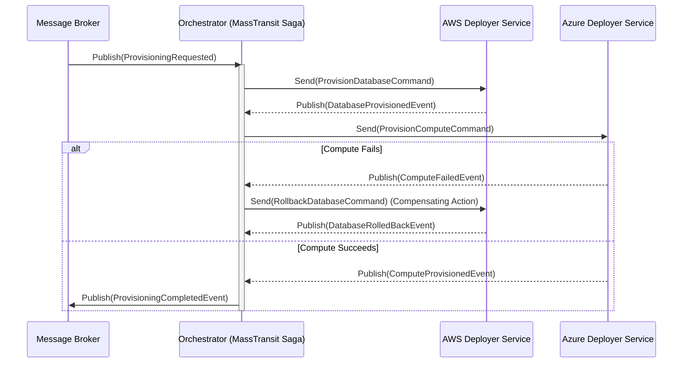

# 🌩️ Cloud Resource Provisioning Orchestrator

[](https://dotnet.microsoft.com/)
[](https://masstransit.io/)
[](https://www.docker.com/)
[](https://opensource.org/licenses/MIT)

**Architecture:** Distributed Event-Driven System (Saga Pattern)  

| Category | Technology |
| :--- | :--- |
| **Tech Stack** | .NET 8, MassTransit 8.2.5, EF Core, SQL Server 2022, RabbitMQ, Docker, Prometheus, Grafana, EKS |
| **Unit Testing** | NUnit |
| **Integration Testing** | NUnit |
| **Linting** | Roslyn Analyzers |
| **Software Composition** | Snyk |
| **Image Scanning** | Trivy (Aqua Security) |

---

## 📖 Overview

The **Cloud Resource Provisioning Orchestrator** acts as the central nervous system for automating complex cloud deployments. Instead of exposing fragile HTTP endpoints or executing direct synchronous API calls, this engine reacts to asynchronous messages in a distributed queue, giving you robust orchestration across multiple cloud providers (AWS, Azure, GCP).

## 🆕 Recent Updates
- Updated the **Docker Containers Map** to mention that the `orchestrator-worker` exposes HTTP metrics on this port.
- Added a new row to the **Monitoring & Dashboards** table for the **Orchestrator Metrics** endpoint ([http://localhost:8080/metrics](http://localhost:8080/metrics)), which provides the raw Prometheus telemetry used by your monitoring stack.

## 📑 Table of Contents
- [Overview](#%F0%9F%93%96-overview)
- [Recent Updates](#-recent-updates)
- [System Design](#%EF%B8%8F-system-design)
- [Key Features](#-key-features)
- [Running the Application](#-running-the-application)
- [Monitoring & Dashboards](#-monitoring--dashboards)
- [Interacting with the Application](#-interacting-with-the-application)
- [Testing & Quality](#-testing--quality)
- [Project Structure](#-project-structure)
- [Future Roadmap](#-future-roadmap)

---

## ⚙️ System Design

This orchestrator sits at the center of a message bus (RabbitMQ) and listens for initial requests. Rather than executing a monolithic script, it initiates a **state machine (Saga)** using [MassTransit](https://masstransit.io/).

By utilizing the **Saga Pattern**, it handles distributed transactions by sending commands to target downstream microservices (e.g., an AWS or Azure deployer) and tracking their successful completion or failure.

### 🔄 Workflow Example
1. **Event Ingestion:** A request to spin up a new environment is published to the broker.
2. **Saga Initiation:** The Orchestrator picks up the event, assigns a correlation ID, and tracks the state.
3. **Command Execution:** The Saga sends targeted commands natively to the underlying deployer services.
4. **Automated Rollbacks:** If an issue occurs downstream (e.g., Azure compute fails after AWS database creation succeeds), the Orchestrator triggers *compensating events* to safely roll back the previous steps.

### 🏗️ Architecture Diagram



---

## ✨ Key Features

- ⛓️ **Distributed Transaction Management:** Robust workflow coordination using Sagas & Routing Slips.
- 🔁 **Automated Compensating Actions:** Seamless rollbacks to ensure consistency during errors.
- 🗄️ **Event Sourcing Tracker:** Clear audit trails of current state transitions persisted to SQL Server.
- 🛡️ **Resiliency Base:** Handles transient errors naturally through built-in message retries and dead-letter queues.

---

## 🚀 Running the Application

The entire orchestrator environment, including databases and monitoring tools, is containerized using **Docker Compose**.

**Prerequisites:** [Docker Desktop](https://www.docker.com/products/docker-desktop) installed on your machine.

```bash
# Build and start all services safely in the background
docker-compose up -d --build
```

### 🐳 Docker Containers Map
When running, the following services initialize automatically:
1. `orchestrator-worker`: The .NET 8 application hosting the MassTransit Saga. Exposes HTTP metrics on port `8080`.
2. `orchestrator-rabbitmq`: The message broker (RabbitMQ 3-Management).
3. `orchestrator-db`: SQL Server 2022 instance storing the Saga state.
4. `orchestrator-prometheus`: Time-series engine for metric scraping.
5. `orchestrator-grafana`: Data visualization dashboard.

---

## 📊 Monitoring & Dashboards

The system provides out-of-the-box UI dashboards for monitoring overall cluster health:

| Service | URL | Credentials | Purpose |
| :--- | :--- | :--- | :--- |
| **Orchestrator Metrics** | [http://localhost:8080/metrics](http://localhost:8080/metrics) | *(None)* | Raw .NET & MassTransit Prometheus telemetry. |
| **RabbitMQ Management** | [http://localhost:15672](http://localhost:15672) | `guest` / `guest` | Monitor queues, message rates, and dead-letter `_error` traces. |
| **Grafana Dashboards** | [http://localhost:3000](http://localhost:3000) | `admin` / `admin` | Visualize `.NET` and `MassTransit` performance latency metrics. |
| **Prometheus Metrics** | [http://localhost:9090](http://localhost:9090) | *(None)* | Raw time-series metric querying interface. |

---

## 🎮 Interacting with the Application

Because this is a backend orchestration engine, it does not expose a traditional HTTP API. Instead, you trigger it by publishing messages into the RabbitMQ Exchange.

**To manually trigger the orchestrator:**
1. Open the [RabbitMQ Management UI](http://localhost:15672) (Credentials: `guest` / `guest`).
2. Navigate to the **Exchanges** tab.
3. Search for and click on **`Orchestrator.Contracts.Order:SubmitOrder`**.
4. Scroll down to the **Publish Message** section and paste the following JSON into the **Payload**:
   ```json
   {
     "orderId": "3fa85f64-5717-4562-b3fc-2c963f66afa6",
     "timestamp": "2026-03-22T23:50:00Z",
     "customerNumber": "CUST-12345"
   }
   ```
5. Click **Publish Message**.
6. Check your `docker-compose` terminal logs to see the worker consume the message, or query your `orchestrator-db` SQL container to view the updated `OrderState` Saga record.

---

## 🧪 Testing & Quality

Both functional correctness and code styling are enforced automatically via .NET 8 CLI tools.

### 1. Automated Testing (NUnit)
The solution includes a robust testing pyramid targeting **NUnit 4.x**. You can run tests via the CLI:

```bash
# Run all tests simultaneously
dotnet test

# Run only Unit Tests
dotnet test tests/Orchestrator.UnitTests/Orchestrator.UnitTests.csproj

# Run only Integration Tests
dotnet test tests/Orchestrator.IntegrationTests/Orchestrator.IntegrationTests.csproj
```

#### Unit Testing the Saga
Testing distributed systems usually involves standing up fragile messaging infrastructure. To avoid this, `Orchestrator.UnitTests` relies on **`MassTransit.Testing.ITestHarness`**.
- This harness spins up an entirely isolated, **in-memory bus** tailored specifically to testing your Saga State Machine logic.
- It tests that the `OrderStateMachine` successfully consumes `SubmitOrder` command messages, correctly transitions its internal state to `Submitted`, and verifies that the `OrderSubmitted` event is seamlessly published back to the queue—all without ever talking to a physical RabbitMQ instance.

#### Integration Testing the Database
`Orchestrator.IntegrationTests` validates the Entity Framework Core infrastructure layer.
- **Entity Hydration Tests:** Utilizing the **`Microsoft.EntityFrameworkCore.InMemory`** provider, it verifies that the `SagaClassMap` properly serializes the Saga's state properties into database columns.
- **End-to-End Saga Tests:** Through `EndToEndSagaIntegrationTests`, it wires the `MassTransit.Testing.ITestHarness` directly to the EF Core repository. This proves that when a message is published, MassTransit consumes it, transitions the Saga's state, and successfully commits those changes to the database without needing a real broker.

### 2. Code Quality & Linting (Roslyn)
To ensure long-term readability, the codebase is bundled with automated static analysis tools known as **Roslyn Analyzers**.

#### How it works:
1. **`Directory.Build.props`**: This master configuration file sits at the root of the repository. It forces every nested C# project to implicitly download and execute standard linting packages.
2. **`StyleCop.Analyzers`**: Scans the AST (Abstract Syntax Tree) to strictly enforce modern C# stylistic standards such as brace layout, using directive placements, and empty line structure.
3. **`SonarAnalyzer.CSharp`**: Actively scans for deeply rooted code smells, potential null references, and performance bottlenecks.
4. **`.editorconfig`**: This acts as the ruleset. It dictates the base configuration (4 spaces, CRLF) and is currently set up to suppress overly restrictive StyleCop warnings (like demanding XML documentation on every single internal property) to keep development fast.

#### Running the Linters
Because these analyzers plug directly into the MSBuild pipeline, you do not need to run a separate tool to lint your code. Every time you build the project, the linters run automatically:
```bash
# This will output all structural warnings and potential bugs
dotnet build
```

#### Fixing Lint Warnings
If you find yourself overwhelmed by minor styling warnings in your IDE, the .NET CLI has an auto-formatter built-in that will automatically repair formatting, spacing, and sorting issues according to the `.editorconfig` rules:
```bash
# Automatically cleans code syntax across the entire solution
dotnet format
```

---

## 📁 Project Structure

- **`src/Orchestrator.Worker`**: The entry-point Generic Host.
- **`src/Orchestrator.StateMachines`**: Defines the `OrderStateMachine` and `OrderState` Saga Instance.
- **`src/Orchestrator.Contracts`**: Shared message interfaces (Commands and Events).
- **`src/Orchestrator.Infrastructure`**: EF Core `SagaDbContext` definitions for SQL Server persistence.
- **`tests/Orchestrator.UnitTests`**: In-memory MassTransit state-machine testing.
- **`tests/Orchestrator.IntegrationTests`**: EF Core persistence mapping integration tests.
- **`docker/`**: Dockerfile configurations and Prometheus mount files.

---

## 🔮 Future Roadmap

To move this orchestrator toward a production-ready cloud management platform, the following features are planned:

- 🏗️ **MassTransit Routing Slips (Courier):** Replace or augment the Saga with Routing Slips to support dynamic, multi-step provisioning sequences that don't require every permutation to be hard-coded in the state machine.
- 🔑 **Secret Management Integration:** Native support for **HashiCorp Vault**, **Azure Key Vault**, or **AWS Secrets Manager** to manage cloud provider credentials rather than using environment variables.
- 🕵️ **OpenTelemetry Deep Tracing:** Integration with **Jaeger** or **Zipkin** to provide full cross-service tracing, allowing you to visualize exactly how a single message pulses through the orchestrator and into downstream deployer services.
- 📜 **Infrastructure as Code (IaC) Triggering:** Direct integration with **Terraform** or **Pulumi** CLI/SDKs to execute actual resource provisioning as part of the Saga workflow.
- 🕒 **Scheduled & Periodic Tasks:** Integration with **MassTransit + Quartz/Hangfire** to handle delayed provisioning retries, cleanup of temporary environments, and periodic health checks of orchestrated resources.
- 🖥️ **Saga Visualizer Dashboard:** A specialized web frontend (e.g., using Blazor) to provide a real-time, high-level overview of all active, failed, and completed deployment sagas across the cluster.

